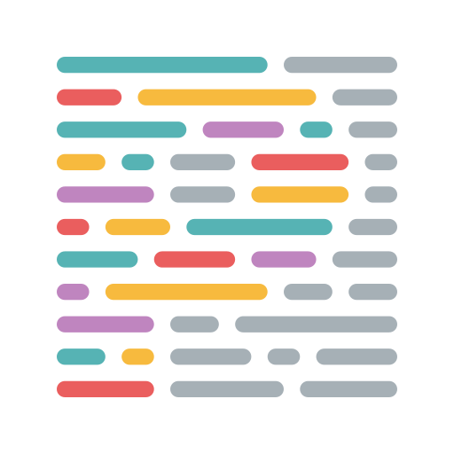
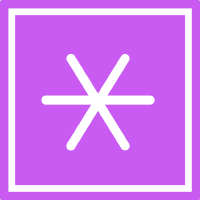
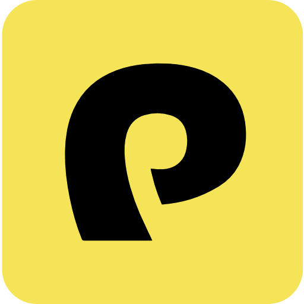
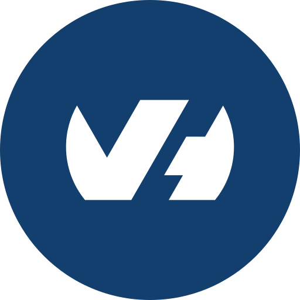

# 🧑‍💻 Portfolio

### This is my most recent portfolio, on which I really put efforts.
### This is my second real project using Next Js, and I'm proud of the result.

### I spent a lot of time designing it before programming, and it really helped me find the way I wanted the portfolio to look.

### I learned a lot of design tips and tricks to make the interface look prettier, and I'm really happy with the result.

### If you want to see the live version, here it is : [My Portfolio](https://timeuh.fr)

### Otherwise, the code is right here.

# 💻 Technologies used
### This project uses a lot of techs, even ones I didn't use before. Here is a list :

## 🖼️ Design

### To design the portfolio, I used Figma.

## 🧱 Project structure

### To create the project, I used Next Js as a base. 
### Then I added Typescript, Eslint and Prettier to maintain the code quality.
### Lastly, I used Prisma for database connection and VineJs for data validation.

  
  
  
  
  

## 💅 Style

### To style the portfolio, I used Panda CSS for the first time, and I liked the way of defining classes.

  

## 🏟️ Deployment

### The project is deployed on an OVH hosted dedicated server, with Docker containers.

  
  

# 📑 Credits
### This portfolio is built by Timothée Brindejonc / Timeuh.
